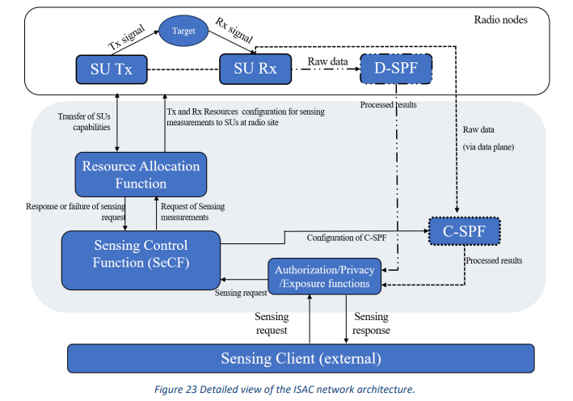

# ISAC Human Presence Detection Prototype

Integrated Sensing and Communications (ISAC) prototype for **human presence detection** using CSI data, implemented as a **service-based architecture** (microservices) in Python.

The code instantiates the functional blocks defined in the 6G ISAC architecture (as used in 6G-MUSICAL and iSEE-6G):

- **Sensing Units (SUs)**
- **Resource Allocation Function (RAF)**
- **Sensing Processing Function (SPF)**
- **Sensing Control Function (SeCF)**
- **Exposure Function (EF)**
- **Sensing Client**

The system exposes a **CAMARA-style REST API** for human presence sensing and uses a **Random Forest** model trained on CSI data to decide whether a human is present in a given sensing area.

---

## 1. Architecture Overview



High-level flow:

1. A **Sensing Client** calls the **Exposure Function API** requesting human presence information for a given area.
2. The **Exposure Function**:
   - checks if the client is authorized for that area;
   - forwards a sanitized sensing request to the **Sensing Control Function (SeCF)**.
3. The **SeCF**:
   - requests CSI measurements from the **Resource Allocation Function (RAF)**;
   - sends the collected CSI frames to the **Sensing Processing Function (SPF)**;
   - receives per-frame presence decisions + uncertainty values;
   - decides whether the ISAC topology should switch (e.g., monostatic ↔ multistatic) based on average uncertainty.
4. The **Exposure Function** returns to the client:
   - the per-frame presence results;
   - the current topology;
   - whether a topology switch occurred.

---

## 2. Repository Structure

```text
.
├── Architecture-ISAC.png       # Architecture diagram
├── 1-short.csv                 # CSI dataset: human presence
├── 2-short.csv                 # CSI dataset: no human presence
├── su_service.py               # Sensing Unit (SU) microservice
├── raf_service.py              # Resource Allocation Function (RAF) microservice
├── spf_service.py              # Sensing Processing Function (SPF, C-SPF/D-SPF) microservice
├── secf_service.py             # Sensing Control Function (SeCF) microservice
├── exposure_service.py         # Exposure Function (CAMARA-style API) microservice
├── sensing_client.py           # External Sensing Client script
└── README.md
```

---

## 3. CSI Dataset and SU Modes

The system uses two example CSI datasets:

- `1-short.csv` – **human presence**
- `2-short.csv` – **no human presence**

Each line contains at least:

- `timestamp` – identifier for a CSI snapshot
- `bin` – subcarrier index
- `ls_re`, `ls_im` – real and imaginary parts of the LS channel estimate

Each **Sensing Unit** is hard-coded to support three modes:

1. `mode = 1` – human presence (samples only from `1-short.csv`)
2. `mode = 2` – no human presence (samples only from `2-short.csv`)
3. `mode = 3` – variable presence (randomly mixes samples from both files)

---

## 4. Requirements

- Python **3.9+** (tested with 3.10/3.11)
- Recommended: virtual environment (`venv`, `conda`, etc.)

### 4.1. Python dependencies

Install with:

```bash
pip install fastapi uvicorn[standard] pydantic requests pandas numpy scikit-learn
```

(You can optionally create a `requirements.txt` with the same list.)

---

## 5. Running the System Locally

All services are standalone FastAPI apps and communicate over HTTP.

Default ports (can be changed inside each script):

- **Sensing Unit (SU)**: `8101`
- **RAF**: `8200`
- **SPF**: `8300`
- **SeCF**: `8400`
- **Exposure Function**: `8500`

> Make sure `1-short.csv` and `2-short.csv` are in the same directory as the scripts.

### 5.1. Start the services

Open **five terminals** (or use tmux / screen) and start the services in this order:

**1. Sensing Unit**

```bash
python su_service.py
# or: uvicorn su_service:app --host 0.0.0.0 --port 8101
```

**2. Resource Allocation Function (RAF)**

```bash
python raf_service.py
# or: uvicorn raf_service:app --host 0.0.0.0 --port 8200
```

**3. Sensing Processing Function (SPF)**

```bash
python spf_service.py
# or: uvicorn spf_service:app --host 0.0.0.0 --port 8300
```

**4. Sensing Control Function (SeCF)**

```bash
python secf_service.py
# or: uvicorn secf_service:app --host 0.0.0.0 --port 8400
```

**5. Exposure Function**

```bash
python exposure_service.py
# or: uvicorn exposure_service:app --host 0.0.0.0 --port 8500
```

You can check each service with its health endpoint, e.g.:

```bash
curl http://localhost:8101/healthz
curl http://localhost:8200/healthz
curl http://localhost:8300/healthz
curl http://localhost:8400/healthz
curl http://localhost:8500/healthz
```

---

## 6. Sensing Client Usage

The **Sensing Client** is a small Python script that calls the Exposure Function and saves results into a CSV file.

Example:

```bash
python sensing_client.py     --base-url http://localhost:8500     --client-id client-A     --area-id room-101     --num-samples 5     --su-mode 3     --output presence_results.csv
```

- `client-A` is pre-configured to be allowed to sense `room-101`.
- `su-mode 3` activates “variable presence”, mixing human / no-human CSI.
- The output file `presence_results.csv` will contain:

  - `timestamp`
  - `human_presence` (True/False)
  - `uncertainty_percent`
  - `client_id`
  - `area_id`
  - `topology_switched`
  - `current_topology`

---

## 7. API Summary

### 7.1. Sensing Unit (`su_service.py`)

- `GET /capabilities`  
  Returns SU capabilities: `suId`, `areaId`, supported modes, number of bins.

- `POST /csi`  
  Request CSI frames.

  **Request body:**
  ```json
  {
    "mode": 3,
    "numFrames": 5
  }
  ```

  **Response:**
  ```json
  {
    "frames": [
      {
        "timestamp": "t1",
        "suId": "SU-1",
        "samples": [
          { "bin": 0, "ls_re": ..., "ls_im": ... },
          ...
        ]
      },
      ...
    ]
  }
  ```

### 7.2. RAF (`raf_service.py`)

- `GET /capabilities`  
  Aggregated capabilities from all SUs.

- `POST /measurements`  
  Retrieves CSI frames for a logical area.

  ```json
  {
    "areaId": "room-101",
    "suMode": 3,
    "numSamples": 5
  }
  ```

### 7.3. SPF (`spf_service.py`)

- `POST /process-csi`  
  Runs ML inference on a list of CSI frames.

  ```json
  {
    "frames": [ ... CSI frames as above ... ]
  }
  ```

  Returns per-frame:

  ```json
  {
    "results": [
      {
        "timestamp": "2025-01-01T12:00:00.000Z",
        "humanPresence": true,
        "uncertaintyPercent": 8.3
      }
    ]
  }
  ```

### 7.4. SeCF (`secf_service.py`)

- `POST /sensing-requests`  
  Orchestrates RAF + SPF and decides topology.

  ```json
  {
    "areaId": "room-101",
    "numSamples": 5,
    "suMode": 3
  }
  ```

  Response:

  ```json
  {
    "topologySwitched": false,
    "currentTopology": "monostatic",
    "results": [ ... SPF results ... ]
  }
  ```

### 7.5. Exposure Function (`exposure_service.py`)

- `POST /isac/human-presence/v0.1/detect`  
  **CAMARA-style human presence API**, exposed to external clients.

  ```json
  {
    "clientId": "client-A",
    "areaId": "room-101",
    "numSamples": 5,
    "suMode": 3
  }
  ```

  Response:

  ```json
  {
    "clientId": "client-A",
    "areaId": "room-101",
    "topologySwitched": false,
    "currentTopology": "monostatic",
    "results": [
      {
        "timestamp": "2025-01-01T12:00:00.000Z",
        "humanPresence": true,
        "uncertaintyPercent": 8.3
      },
      ...
    ]
  }
  ```

Authorization is implemented with a simple in-memory mapping:

```python
allowed_areas_by_client = {
    "client-A": ["room-101"],
    "client-B": ["room-101", "room-102"],
}
```

Requests outside the allowed mapping return `HTTP 403`.

---

## 8. Development Notes / Extensibility

- Multiple SUs can be added by extending `SUS_CONFIG` in `raf_service.py` and deploying additional `su_service.py` instances (possibly with different CSV datasets, bands, or antenna configurations).
- The ML model in `spf_service.py` can be replaced with more advanced models (e.g., deep learning) as long as they expose the same `infer_from_csi()` interface.
- Topology adaptation logic in `secf_service.py` is intentionally simple (average uncertainty threshold). More complex policies can integrate additional KPIs (latency, energy, number of active SUs, etc.).
- The Exposure API is intentionally aligned with CAMARA patterns (client-centric, area-based, JSON over HTTPS) to ease future integration into operator NEF/NEP platforms.

---

## 9. Acknowledgment

This work was supported by the 6G-MUSICAL (Grant Agreement No. 101139176) and iSEE-6G (Grant Agreement No. 101139291) Horizon Europe SNS-JU projectS funded by the European Commission.
